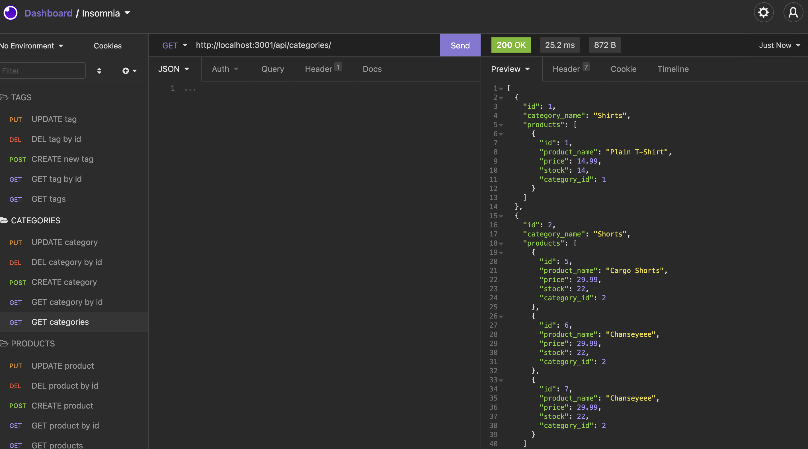

# <ins>E-Commerce Back End</ins>

## <ins>Description</ins>

Task is to build the back end for an e-commerce site

## <ins>Table of Contents</ins>

- [Installation](#installation)
- [Usage](#usage)
- [License](#license)
- [Features](#features)
- [Contributions](#contributions)
- [Tests](#tests)
- [Questions](#questions)

## <ins>Installation</ins>

npm i, mysql

## <ins>Usage</ins>

AS A manager at an internet retail company
I WANT a back end for my e-commerce website that uses the latest technologies
SO THAT my company can compete with other e-commerce companies

### [Check out demo video!](https://www.youtube.com/watch?v=9grjOViAVZE)

## <ins>License</ins>

This project is covered under MIT

## <ins>Features</ins>

- Add a database name, MySQL username, and MySQL password to an environment variable file

- Connect to a database using Sequelize

- Development database is created and is seeded with test data

- Server is started and the Sequelize models are synced to the MySQL database

- Data for each of these routes is displayed in a formatted JSON

- Successfully create, update, and delete data in my database

## <ins>Contributions

xBOBOYx

## <ins>Tests</ins>

no testing done

## <ins>Questions</ins>

Contact BOBOY at boboy.zamora@gmail.com. Github link: https://github.com/xBOBOYx
